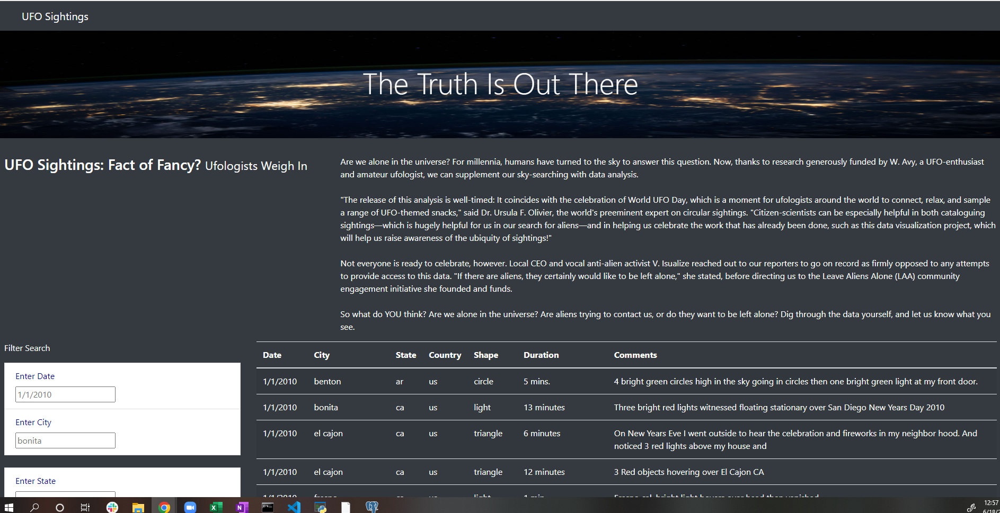

# UFOs
Using Javascript, HTML & bootstrap to create webpage for UFO sightings.

## Project Overview
The main ojective for our client was to create a filterable website for UFO sightings data. Using Javascript to create the table combined with HTML/CSS we were able to modify the aesthetic of the webpage to our clients liking.

## Results
### Website link
The deployed webpage can be found at: file:///C:/Users/natal/Documents/UFOs/static/index.html

### Interactive Filter Table
Once at the home page, you can see the UFO Sightings data alongside a filterable table by Data, City, State, Country or Shape.
A great feature of the filterable table is that you do not need to enter all of the information, but pick and choose which filters you would like to use

## Summary

### Drawbacks
In order for the website to run accordingly, the user must be familiar with specific dates, cities & shapes to search.
For instance, you cannot just type in any date without checking that is cooresponds with the data available

### Recommendations
* While pressing the "UFO Sightings" in top left of screen automatically refreshs the page, I believe a "clear table" button below the filtered table would be more directly user friendly and accessible.
* Given that the user needs to be knowledgeable on the data set, I would recommend creating drop down tables with available selections rather than an open ended box. This will ensure that every search they execute will produce at least one result.
